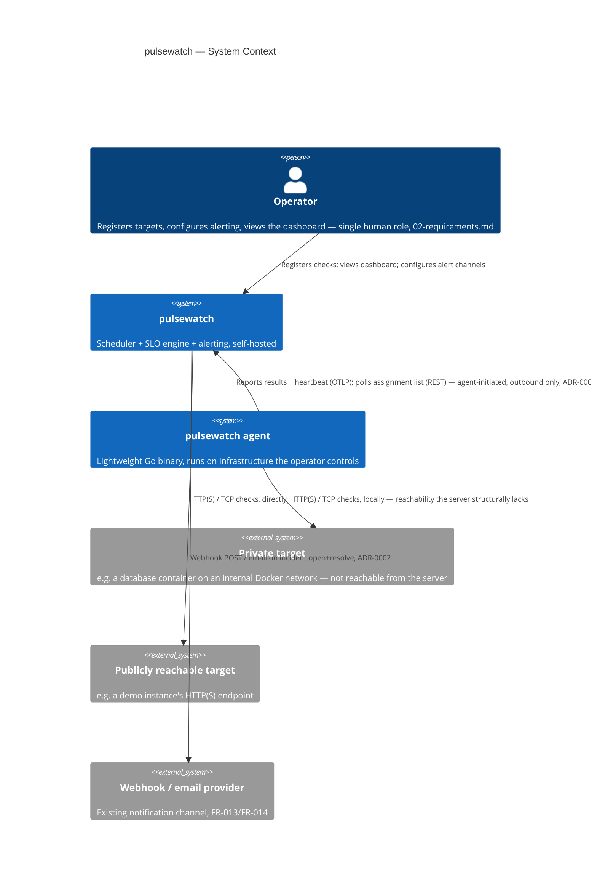
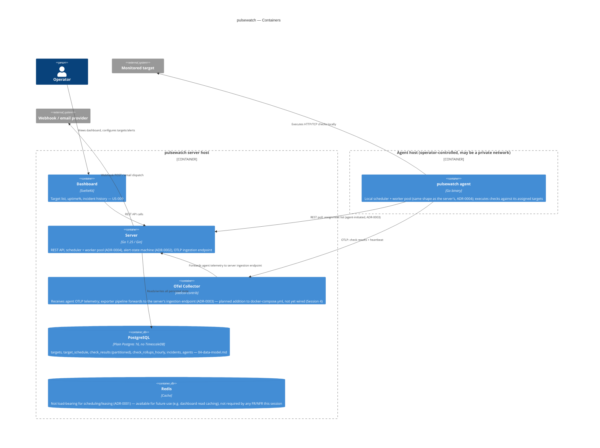
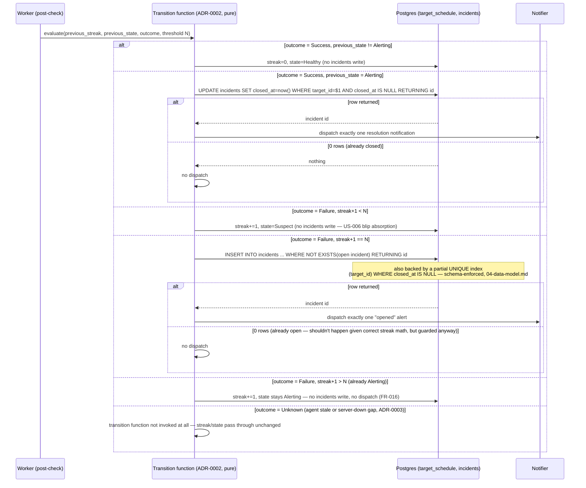

# Architecture
> Purpose: how the system is structured and why
> Project: pulsewatch (public)
> Last updated: 2026-08-29
> Depth: baseline (per `docs/SDLC-EVIDENCE.md` / `00a-ledger-confirmation.md`,
> this repo's two deep phases are Release & Deployment and Operations &
> Maintenance) — but four of the decisions below are real ADRs
> (`docs/adr/`) with options-considered rigor on their own merits,
> independent of the phase's overall depth marker, because several of
> `02-requirements.md`'s requirements have no obvious default
> implementation and needed genuine design work, not a diagram.

## System context diagram



## Container/component diagram



## Component responsibilities and boundaries

| Component | Responsibility | Explicitly not responsible for |
|---|---|---|
| Dashboard (SvelteKit) | Renders target status, uptime%, incident history from server API responses (US-009) | Any SLO computation, alert-state evaluation, or "is this agent stale" logic — it displays what the server already decided, never computes health itself |
| Server (Go/Gin) | Scheduler + bounded worker pool (ADR-0004); Postgres-backed leasing and run-exclusivity (ADR-0001); alert-suppression state machine (ADR-0002); agent assignment-list API and OTLP-forwarded-telemetry ingestion (ADR-0003); rollup and retention background jobs | Executing checks against targets the agent is responsible for — the server never dials a private target directly; that's structurally the agent's job |
| OTel Collector | Receives agent OTLP traffic (check results, heartbeats); forwards to the server's ingestion endpoint via its exporter pipeline | Writing to Postgres directly, or making any scheduling/alerting decision — it is a transport hop, not a second system of record (ADR-0003) |
| PostgreSQL | Sole system of record for every piece of durable state — scheduling leases, alert-suppression streak/state, incidents, check history, rollups (04-data-model.md) | Nothing is authoritative in-memory-only; a process restart must be able to reconstruct everything it needs from Postgres alone (ADR-0001) |
| Redis | Available cache-layer infrastructure (already in the stack) | Not used for scheduling leases or alert-state (ADR-0001 explicitly rejects it there) — no requirement this session assigns Redis a load-bearing role; it remains available for a future, non-correctness-critical use (e.g. dashboard read caching) without being architecturally required |
| pulsewatch agent | Runs its own local scheduler/worker pool against its assigned targets; reports agent-initiated, outbound-only (FR-018) | Accepting any inbound connection from the server — the server has no network path to the agent by design (ADR-0003) |

## Key flows

### Normal check execution (server-executed and agent-executed)

```mermaid
sequenceDiagram
    participant T as Scheduler tick (1s, ADR-0004)
    participant DB as Postgres (target_schedule)
    participant W as Worker (pool, ADR-0004)
    participant Tgt as Target (HTTP/TCP)
    participant SM as Alert state machine (ADR-0002)

    T->>DB: SELECT due targets (next_due_at <= now())
    DB-->>T: due target IDs
    T->>W: push job (blocking send — backpressure, ADR-0004)
    W->>DB: claim lease (UPDATE ... WHERE due AND lease expired, ADR-0001)
    alt claim failed (0 rows)
        DB-->>W: no rows
        W->>W: discard job silently (already running or no longer due)
    else claim succeeded
        DB-->>W: target_id
        W->>Tgt: execute check, context.WithTimeout(target.Timeout)
        Tgt-->>W: result (success/failure/timeout)
        W->>DB: INSERT check_results; release lease; advance next_due_at (one transaction)
        W->>SM: evaluate transition (streak, state)
        SM->>DB: conditional incident open/close if edge-transition (ADR-0002)
        opt incident opened or closed
            SM->>SM: dispatch alert (webhook/email)
        end
    end
```

Agent-executed targets follow the identical shape, run by the agent's own
local scheduler/worker pool against its own local Postgres-free in-memory
due-set (the agent has no Postgres access — its "due" computation is local,
based on its last-known assignment list and each target's interval); the
result then reaches the server via OTLP → OTel Collector → server ingestion
endpoint (ADR-0003), which performs the identical claim/release/evaluate
sequence shown above on the server's own Postgres. The agent path and the
server-direct path converge on the exact same result-recording and
alert-evaluation code — there is no separate, lower-rigor path for
agent-sourced data.

### Restart-recovery flow

```mermaid
sequenceDiagram
    participant Old as Old process
    participant New as New process
    participant DB as Postgres (target_schedule)

    Note over Old: SIGTERM received
    Old->>Old: stop issuing new ticks/claims
    Old->>Old: in-flight workers keep running under their own per-check timeout (ADR-0004)
    par graceful drain, bounded by hard shutdown deadline
        Old->>DB: (in-flight checks that finish naturally) release lease, record result
    and
        New->>DB: connect
        New->>New: start worker pool (ADR-0004)
    end
    Note over Old: hard deadline reached — any still-running worker force-canceled;<br/>its lease is abandoned, not cleared
    Old->>Old: process exits
    New->>DB: first tick — SELECT due targets (next_due_at <= now())
    Note over DB: includes targets overdue at crash time,<br/>and any target whose lease_expires_at is now in the past<br/>(abandoned by Old, ADR-0001) — no special-cased recovery query
    DB-->>New: due target IDs (bounded batch, worker pool size = 20, ADR-0004)
    New->>New: dispatch through worker pool — bounded fan-out, not a synchronized burst (US-007)
    Note over New: streak/state/incidents already correct —<br/>read straight from target_schedule/incidents, no reconstruction logic (ADR-0002)
```

The load-bearing property this diagram is meant to make visible: **there is
no distinct "restart recovery" code path.** The first tick after a restart
runs the exact same due-set query and claim statement as every other tick
(ADR-0001) — recovery is a consequence of the scheduling and leasing design
being correct generally, not a special case built for the restart moment
specifically. This is what makes NFR-003 (≤10s recovery) achievable without
a bespoke, separately-tested recovery routine: the routine tick logic is
what's being tested.

### Alert-fire-vs-suppress decision flow



## Scalability approach

Not a driving concern at this project's actual scale (~5–10 targets today,
NFR-003's own ≤100-target ceiling) — every mechanism above (ADR-0001's
leasing, ADR-0004's worker pool, the single-tier hourly rollup in
`04-data-model.md`) is explicitly sized against that ceiling rather than
generic "web scale," per Session 1's own framing
(`00b-build-vs-alternatives.md`: this system is sized to the actual target
count, not a market segment). Where a design choice already generalizes
without modification if that changes (e.g. ADR-0001's leasing under a
future second server instance), it is noted in that ADR's own revisit
triggers rather than built out speculatively now.

## Failure handling and degradation modes

- **Postgres unavailable:** the scheduler cannot claim, execute-record, or
  evaluate — it degrades to doing nothing rather than doing something
  incorrect (no in-memory fallback scheduling exists to diverge from
  persisted state). This is a direct consequence of Postgres being the
  sole system of record (ADR-0001) — there is no version of this
  architecture that keeps scheduling "working" through a Postgres outage
  without reintroducing the exact in-memory-state risk ADR-0001 rejected.
- **A single check target times out or errors:** recorded as a failure
  with a specific reason (US-002, US-003), evaluated by the state machine
  like any other failure — no special-cased handling, this is the routine
  path, not a degradation.
- **Agent goes stale (misses its heartbeat window):** its assigned
  targets' state becomes `Unknown` (not `Alerting`) — evaluation is
  suspended, not corrupted (ADR-0003). No alert fires for staleness itself
  in v1; the requirement (FR-019/NFR-008) is correctly *not* alerting on an
  agent gap the same way a target failure would, which is itself the
  degradation-mode decision, not an omission.
- **Alert-channel delivery fails** (webhook endpoint down, email provider
  error): the `alert_dispatches` row records `delivery_confirmed = false`;
  retry/backoff semantics for delivery itself are an Implementation
  (Session 4) concern this ADR set deliberately leaves there (ADR-0002
  Consequences) — this document fixes that a dispatch is *attempted*
  exactly once per edge-transition, not that delivery itself always
  succeeds.
- **OTel Collector unavailable:** agent-executed targets' results queue
  locally at the agent (bounded by the agent's own local storage — an
  Implementation-level buffering detail, not fixed here) until the
  collector recovers; from the server's perspective this looks identical
  to that agent going stale (`Unknown`, not `Alerting`) — the same
  mechanism handles both causes, per ADR-0003.

## Backup and recovery design (RPO / RTO)

Deferred to `08-deployment-and-operations.md` as a deployment-configuration
concern, not invented here without a concrete backup mechanism chosen yet —
matching this repo's own "Operations & Maintenance is a deep phase, but
that work happens there" framing. What this document fixes now: PostgreSQL
is the only component requiring backup for correctness (everything else —
the collector, the agent, the server itself — is stateless and
re-derivable); `check_results` partitions are inherently the lowest-value
backup target (raw data already has a short, 30-day-default retention and
is largely re-derivable as "unknown" gaps if lost, not silently wrong data)
while `target_schedule`, `incidents`, and `check_rollups_hourly` are the
higher-value targets, since losing them (not just being stale) would
directly corrupt the restart-safety and SLO-correctness properties this
whole session exists to design for.

## Technology choices (links to ADRs)

- **Restart-safe, duplicate-proof scheduling: Postgres row leasing, not
  in-memory tracking, Redis locks, or advisory locks** —
  [`docs/adr/ADR-0001-scheduler-restart-safety-leasing.md`](../adr/ADR-0001-scheduler-restart-safety-leasing.md).
- **Alert suppression: an explicit 3-state machine with database-enforced
  exactly-once transitions, not an inline counter check** —
  [`docs/adr/ADR-0002-alert-suppression-state-machine.md`](../adr/ADR-0002-alert-suppression-state-machine.md).
- **Agent reachability: agent-initiated push (results via OTLP, assignment
  discovery via authenticated REST poll), not server-pull or a static
  config file** —
  [`docs/adr/ADR-0003-agent-push-reachability-model.md`](../adr/ADR-0003-agent-push-reachability-model.md).
- **Scheduler concurrency: a long-lived, bounded worker pool with
  context-based graceful drain, not unbounded goroutines or a per-tick
  errgroup** —
  [`docs/adr/ADR-0004-go-concurrency-worker-pool.md`](../adr/ADR-0004-go-concurrency-worker-pool.md).
- **Rollup/retention on plain PostgreSQL** (declarative partitioning +
  partition-drop retention + a single 400-day hourly rollup tier) — the
  concrete consequence of Session 1's TimescaleDB rejection, detailed in
  `04-data-model.md` rather than as a fifth ADR, since it is a direct,
  frozen-decision consequence rather than a new options-considered choice
  this session is making from scratch.

### Where OpenTelemetry actually fits (self-observability scope)

`00a-ledger-confirmation.md` names OpenTelemetry collector pipelines as a
learning objective for **agent → server telemetry** (ADR-0003) — that use
is fixed. This session additionally scopes a second, narrower use:
**pulsewatch observing its own scheduler/check-execution/alerting
behavior**, not an open-ended "add tracing everywhere" statement:

- The server's own scheduler tick, worker-pool claim/execute/release cycle
  (ADR-0001/ADR-0004), and alert state-machine transitions (ADR-0002) are
  instrumented with OTel spans/metrics — tick latency, worker-pool
  utilization (busy/idle count), lease-claim contention, check execution
  duration, and shutdown-drain duration.
- These are exported to the same OTel Collector container already required
  for agent telemetry (ADR-0003), via a **separate pipeline** in the
  collector's config (distinct receiver/processor/exporter chain from the
  agent-telemetry pipeline it also carries) — one collector, two logically
  distinct jobs, not two collectors.
- **Explicitly out of scope for v1:** a visualization backend for this
  telemetry (Grafana or equivalent) is not built — that would reintroduce
  exactly the third-new-technology problem `01-scope-and-non-goals.md`
  already excludes (Prometheus/Grafana). Self-observability telemetry is
  exported via the collector's logging/debug exporter (or a local file
  exporter) for now: the point is that the instrumentation exists and
  produces structured, inspectable data — proving the learning objective
  and giving a real debugging tool — not that it's rendered on a
  dashboard. If a future session finds a genuine operational need to
  visualize it, that is a new decision to make explicitly then, not an
  implicit scope expansion of this one.
